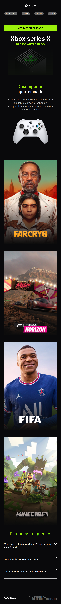

# Landing Page com layout resposinvo e FAQ accordion

Esta é uma solução para o desafio 21 da Codelândia de uma página inicial de layout responsivo com uma faq accordion no final da página. 

## Índice

- [Visão geral](#visão-geral)
  - [O desafio](#o-desafio)
  - [Captura de tela](#captura-de-tela)
  - [Links](#links)
- [Meu processo](#meu-processo)
  - [Tecnologias utilizadas](#tecnologias-utilizadas)
  - [O que aprendi](#o-que-aprendi)
  - [Status do projeto](#status-do-projeto)
  - [Recursos úteis](#recursos-úteis)
- [Autora](#autora)
- [Licença](#licença)

## Visão geral

### O desafio

Os usuários devem ser capazes de:

- Ver o layout ideal para o site, dependendo do tamanho da tela do dispositivo (360px/1440px)
- Ver os estados de foco para todos os elementos interativos na página

### Captura de tela




### Links

- URL da solução: [GitHub](https://github.com/adynaslima/Projeto-Xbox.git)
- URL do site: [Site](https://projeto-xbox.vercel.app/)

## Meu processo

### Tecnologias utilizadas

- Marcação HTML5 semântica
- Propriedades personalizadas CSS
- Flexbox
- Fluxo de trabalho móvel primeiro
- JavaScript

### O que aprendi

```js
    const faq = document.querySelectorAll (".section__faq-accordion");

    faq.forEach(faq => {
        faq.addEventListener("click", () => {
            faq.classList.toggle("active");
        })
    })
```

### Status do projeto

Em construção...

### Recursos úteis

- [Vídeo sobre FAQ accordion](https://www.youtube.com/watch?v=4qnWreynXLU) - Esse vídeo me ajudou a desenvolver a FAQ accordion. Recomendo a todos que estão iniciando JavaScript e desejam fazer alguma aplicação mais básica. 

## Autora

- GitHub - [Adyna Lima](https://github.com/adynaslima)
- LinkedIn - [Adyna Lima](https://www.linkedin.com/in/adynalima/)

## Licença

Este projeto está licenciado nos termos da licença MIT.